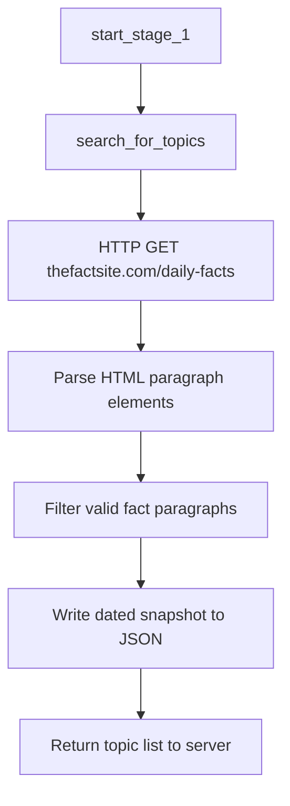

# Stage 1 — Topic Discovery

## Purpose

Stage 1 is the entry point of the RAGE post-generation pipeline. It discovers candidate topics from an external source and makes them available to downstream stages. The output feeds content creators and automated publishing workflows with a fresh, dated list of post ideas.

---

## Position in the Pipeline

| Attribute | Value |
|-----------|-------|
| Stage number | 1 |
| Triggered by | `POST /start` in `app/server.py` |
| Next stage | Stage 2 — Topic Selection |
| Failure message | `"Failed to fetch topics"` |

Stage 1 must complete successfully and return a non-empty topic list before the pipeline continues.

---

## Module Structure

```
app/stage_1/
├── stage_1_man.py                          # Stage orchestrator
└── search_for_trending_piece/
    └── search_topic.py                     # Web scraper and topic persistence
```

| Module | Responsibility |
|--------|----------------|
| `stage_1_man.py` | Coordinates discovery, timestamps the batch, writes `latest_topics.json`, returns the topic list. |
| `search_topic.py` | Scrapes The Fact Site daily facts page and extracts structured topic objects. |

---

## Workflow



### Step-by-step

1. **Orchestrator entry** — `start_stage_1()` is invoked by the Flask server when a new post run begins.
2. **Source fetch** — `search_for_topics()` requests `https://www.thefactsite.com/daily-facts/` with browser-like HTTP headers.
3. **HTML parsing** — BeautifulSoup walks `<p>` elements whose CSS classes match the pattern `gb-text-<8 hex characters>`.
4. **Content filtering** — Paragraphs shorter than 30 characters and known boilerplate phrases (site attribution, disclaimers) are excluded.
5. **Persistence** — Topics are stored under today's date key in the scraper's local JSON archive and again by the orchestrator in `data/json/latest_topics.json`.
6. **Return value** — A list of objects shaped as `{"topic": "<fact text>"}` is passed to Stage 2.

---

## Inputs and Outputs

### Input

None. Stage 1 is self-contained and reads from its configured external source.

### Output

| Field | Type | Description |
|-------|------|-------------|
| Return value | `list[dict]` | Candidate topics, each with a `topic` string. |
| `data/json/latest_topics.json` | File | Snapshot written by the orchestrator: `{ "date_updated": "YYYY-MM-DD", "topics": [...] }`. |

### Error output

On scrape failure, `search_for_topics()` may return:

```python
{"error": <exception>}
```

An empty list `[]` is treated as a pipeline failure by the server.

---

## Data Files

| Path | Written by | Format |
|------|------------|--------|
| `data/json/latest_topics.json` | `stage_1_man.py` | `{ "date_updated": str, "topics": [{"topic": str}, ...] }` |
| Scraper-local archive | `search_topic.py` | Date-keyed dictionary of topic arrays |

---

## External Dependencies

| Dependency | Usage |
|------------|-------|
| `requests` | HTTP fetch of the source page |
| `beautifulsoup4` | HTML parsing and element extraction |
| The Fact Site | Default topic discovery source |

Network access is required at runtime.

---

## Error Handling

| Condition | Behavior |
|-----------|----------|
| HTTP status ≠ 200 | Returns empty list `[]` |
| Network or parse exception | Returns `{"error": ...}` |
| Empty topic list | Server stops pipeline with `"Failed to fetch topics"` |
| Invalid existing JSON on disk | Returns error dict from scraper |

---

## Integration

```python
# app/server.py
searched_topics = start_stage_1()
```

The server validates the result before calling `start_stage_2(searched_topics)`.

---

## Operational Notes

- Run the application from the **project root** so relative paths such as `data/json/latest_topics.json` resolve correctly.
- The scraper uses a desktop User-Agent header to reduce the likelihood of HTTP blocking.
- Topic quality depends on the structure of the external source page; changes to that site's markup may require scraper updates.

---

## Related Documentation

- [Stage 2 — Topic Selection](stage_2.md)
- [Project README](../readme.md)
