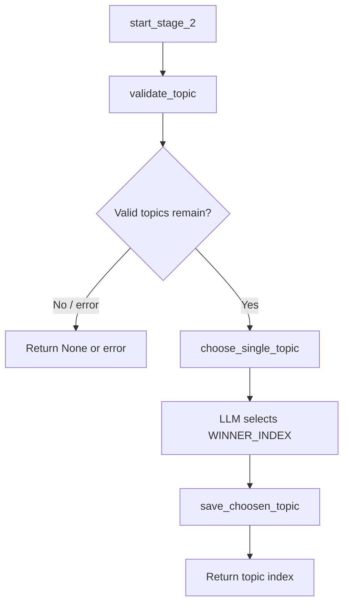

# Stage 2 — Topic Selection

## Purpose

Stage 2 selects a single post topic from the candidate list produced by Stage 1. It removes previously used topics, uses an LLM to rank engagement potential, and records the selection so the same topic is not published twice.

---

## Position in the Pipeline

| Attribute | Value |
|-----------|-------|
| Stage number | 2 |
| Preceded by | Stage 1 — Topic Discovery |
| Followed by | Stage 3 — Research |
| Failure messages | `"Failed to choose topic"` |

---

## Module Structure

```
app/stage_2/
├── stage_2_man.py                                          # Stage orchestrator
├── validate_topics_by_removing_duplicates/
│   └── validate.py                                         # Deduplication against used topics
├── choose_a_topic_to_continue_with/
│   └── choose.py                                           # LLM-based topic selection
└── save_choosen_topic_in_used_topics/
    └── save.py                                             # Persist selected topic
```

| Module | Responsibility |
|--------|----------------|
| `stage_2_man.py` | Runs validate → choose → save in sequence; returns the chosen index. |
| `validate.py` | Removes topics already present in `used_topics.json`. |
| `choose.py` | Sends numbered candidates to the LLM and parses `WINNER_INDEX: N`. |
| `save.py` | Appends the chosen topic object to the used-topics registry. |

---

## Workflow



### Step-by-step

1. **Deduplication** — `validate_topic()` loads `data/json/used_topics.json` and removes any topic objects already published.
2. **LLM selection** — `choose_single_topic()` formats the remaining topics as a numbered list and asks the model to pick the most engaging fact for a social post.
3. **Index parsing** — The model must respond with a final line matching `WINNER_INDEX: <number>`. Out-of-range indices are rejected.
4. **Persistence** — `save_choosen_topic()` appends the selected topic dict to `used_topics.json`.
5. **Return value** — The integer index into the original `topics` list is returned to the server.

---

## Inputs and Outputs

### Input

| Parameter | Type | Source |
|-----------|------|--------|
| `topics` | `list[dict]` | Output of Stage 1; each item has at least a `"topic"` key. |

### Output

| Field | Type | Description |
|-------|------|-------------|
| Return value | `int` | Index of the chosen topic in the input list. |
| `data/json/used_topics.json` | File | Updated list of previously published topics. |

### Error output

Returns `None` or `{"error": ...}` when validation, selection, or persistence fails.

---

## Environment Variables

| Variable | Required | Usage |
|----------|----------|-------|
| `BASE_URL` | Yes | LLM API base URL |
| `API_KEY` | Yes | LLM API key |
| `RESONNING_MODEL` | Yes | Model used for topic ranking |

Selection uses a low temperature (`0.2`) for consistent, deterministic index output.

---

## LLM Selection Criteria

The system prompt instructs the model to favor topics that are:

- Absurd but true
- Relatable or comedic
- Mind-bending in scale or implication

The model must provide reasoning and end with exactly one `WINNER_INDEX: N` line.

---

## Data Files

| Path | Format |
|------|--------|
| `data/json/used_topics.json` | JSON array of topic objects (same shape as Stage 1 output items) |

---

## Error Handling

| Condition | Behavior |
|-----------|----------|
| All topics already used | Empty list after validation → selection fails |
| Model omits `WINNER_INDEX` | Returns `None` |
| Index out of range | Logged and returns `None` |
| LLM or file I/O exception | Returns `{"error": ...}` |

---

## Integration

```python
# app/server.py
chosen_topic_index = start_stage_2(searched_topics)
chosen_topic_text = searched_topics[chosen_topic_index]['topic']
```

The topic text string is passed to Stages 3–7.

---

## Operational Notes

- The used-topics registry grows monotonically; reset `used_topics.json` only when you intentionally want to allow topic reuse.
- Topic selection quality depends on the configured LLM and the remaining candidate pool after deduplication.

---

## Related Documentation

- [Stage 1 — Topic Discovery](stage_1.md)
- [Stage 3 — Research](stage_3.md)
- [Project README](../readme.md)
