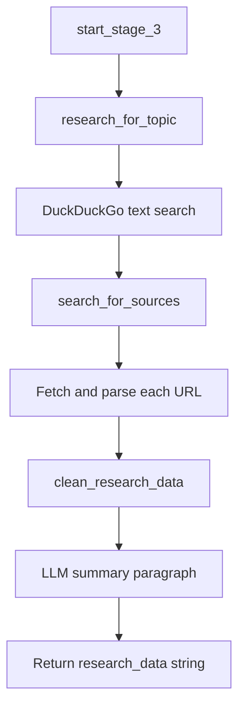

# Stage 3 — Research

## Purpose

Stage 3 builds the factual foundation for a post. It searches the web for sources related to the selected topic, scrapes readable content from result pages, and summarizes the collected material into a single clean paragraph suitable for caption and image generation.

---

## Position in the Pipeline

| Attribute | Value |
|-----------|-------|
| Stage number | 3 |
| Preceded by | Stage 2 — Topic Selection |
| Followed by | Stage 4 — Caption Generation |
| Failure message | `"Failed to research topic"` |

---

## Module Structure

```
app/stage_3/
├── stage_3_man.py                          # Stage orchestrator
├── research_on_provided_topic/
│   └── research.py                         # DuckDuckGo search
├── search_on_the_given_sources/
│   └── scrap.py                            # Web page content extraction
└── clean_research_data/
    └── clean_data.py                       # LLM summarization
```

| Module | Responsibility |
|--------|----------------|
| `stage_3_man.py` | Chains search → scrape → summarize. |
| `research.py` | Runs a text search for the topic and returns top result metadata. |
| `scrap.py` | Fetches each result URL and extracts article body text. |
| `clean_data.py` | Summarizes raw scraped text into one concise paragraph. |

---

## Workflow



### Step-by-step

1. **Web search** — `research_for_topic()` queries DuckDuckGo with the topic text (up to 5 results, worldwide region).
2. **Snippet collection** — Search result `body` fields are prepended to the research corpus immediately.
3. **Page scraping** — For each result URL, `search_for_sources()` fetches HTML and extracts paragraph content using a multi-strategy parser:
   - Known article container CSS classes
   - Semantic `<article>` tags
   - Parent-element scoring fallback
   - Div/span fallback selectors (`excerpt`, `summary`, etc.)
4. **Noise reduction** — Scripts, navigation, subscription prompts, and short fragments are stripped.
5. **Summarization** — `clean_research_data()` sends the consolidated raw text to the LLM with instructions to produce a single factual paragraph.
6. **Return value** — A plain-text research summary string is passed to Stages 4 and 5.

---

## Inputs and Outputs

### Input

| Parameter | Type | Description |
|-----------|------|-------------|
| `topic` | `str` or `dict` | Topic text from Stage 2; dict form uses the `"topic"` key. |

### Output

| Field | Type | Description |
|-------|------|-------------|
| Return value | `str` | Clean, single-paragraph research summary. |

### Error output

Any submodule may return `{"error": ...}`. The server treats this as a pipeline failure.

---

## Environment Variables

| Variable | Required | Usage |
|----------|----------|-------|
| `BASE_URL` | Yes | LLM API base URL (summarization step) |
| `API_KEY` | Yes | LLM API key |
| `RESONNING_MODEL` | Yes | Model used for research cleaning |

Summarization uses temperature `0.2` for factual consistency.

---

## External Dependencies

| Dependency | Usage |
|------------|-------|
| `ddgs` | DuckDuckGo search API |
| `requests` | HTTP fetch of result pages |
| `beautifulsoup4` | HTML parsing |
| OpenAI-compatible LLM | Research summarization |

---

## Scraping Safeguards

| Safeguard | Description |
|-----------|-------------|
| JS-only domain skip list | Hosts like `msn.com` are skipped because static HTML scraping returns no content. |
| HTTP 403 handling | Blocked pages are logged and skipped without stopping the pipeline. |
| Empty body detection | Pages with fewer than 100 characters of body text are treated as JS-rendered and skipped. |
| Boilerplate filter | Subscription, cookie, and copyright phrases are excluded from extracted text. |
| Per-URL error isolation | A single failed URL does not abort scraping of remaining sources. |

---

## Error Handling

| Condition | Behavior |
|-----------|----------|
| DuckDuckGo provider error | Returns `{"error": ...}` |
| All URLs fail to scrape | May return empty or minimal raw text; summarization still attempted |
| LLM failure during cleaning | Returns `{"error": ...}` |

---

## Integration

```python
# app/server.py
research_data = start_stage_3(chosen_topic_text)
```

The research string is consumed by Stage 4 (caption), Stage 5 (image prompt), and Stage 7 (post description).

---

## Operational Notes

- Scraping behavior varies by target site; some publishers block automated requests.
- Research quality improves when search results link to text-heavy articles rather than SPAs or paywalled pages.
- The summarization step is intentionally concise to keep downstream prompts within model context limits.

---

## Related Documentation

- [Stage 2 — Topic Selection](stage_2.md)
- [Stage 4 — Caption Generation](stage_4.md)
- [Project README](../readme.md)
