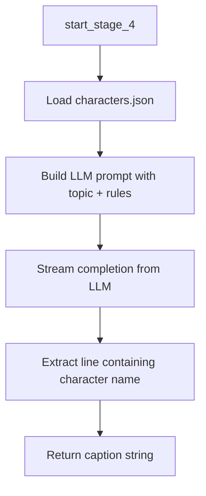

# Stage 4 — Caption Generation

## Purpose

Stage 4 produces the visible caption text for a post. Using the selected topic and research summary from prior stages, an LLM writes a short, character-driven headline that will be overlaid on the post image in Stage 6.

This stage defines the voice and hook of the published content — the line audiences read first when the post appears on a content platform.

---

## Position in the Pipeline

| Attribute | Value |
|-----------|-------|
| Stage number | 4 |
| Preceded by | Stage 3 — Research |
| Followed by | Stage 5 — Image Generation |
| Failure message | `"Failed to generate meme text"` |

---

## Module Structure

```
app/stage_4/
├── stage_4_man.py                          # Stage orchestrator
└── make_a_meme/
    └── meme.py                             # LLM caption generation and post-processing
```

| Module | Responsibility |
|--------|----------------|
| `stage_4_man.py` | Invokes caption generation and returns the final caption string. |
| `meme.py` | Loads character profiles, prompts the LLM, and extracts a single caption line. |

---

## Workflow



### Step-by-step

1. **Character registry** — `meme_text_generate()` loads `data/json/characters.json`, a list of character names and personality tropes.
2. **Prompt assembly** — The user message includes strict caption rules: tone, format, word limit (under 20 words), banned vocabulary, and worked examples.
3. **LLM generation** — An OpenAI-compatible chat completion is streamed at temperature `0.85` for creative variation.
4. **Post-processing** — The response is scanned line-by-line for the first line containing a configured character name; markdown heading prefixes are stripped.
5. **Fallback** — If no character match is found, the first non-empty line is returned.
6. **Return value** — A single caption string is passed to Stages 5 and 6.

---

## Inputs and Outputs

### Input

| Parameter | Type | Source |
|-----------|------|--------|
| `research_data` | `str` | Stage 3 output (available to the module; primary prompt input is the topic) |
| `chosen_topic` | `str` | Topic text from Stage 2 |

### Output

| Field | Type | Description |
|-------|------|-------------|
| Return value | `str` | Single-line post caption for image overlay |

### Error output

Returns `{"error": ...}` on file read failure or LLM exception.

---

## Environment Variables

| Variable | Required | Usage |
|----------|----------|-------|
| `BASE_URL` | Yes | LLM API base URL |
| `API_KEY` | Yes | LLM API key |
| `RESONNING_MODEL` | Yes | Model used for caption generation |

---

## Data Files

| Path | Format | Usage |
|------|--------|-------|
| `data/json/characters.json` | JSON array of `{ "character": str, "trope": str }` | Defines allowed character names and voice profiles |

Characters include figures such as Homer Simpson, SpongeBob, Patrick Star, Bugs Bunny, Dexter, and others. The caption must reference one of these names so Stage 5 can align the visual character with the text.

---

## Caption Rules (LLM Instructions)

| Rule | Detail |
|------|--------|
| Tone | Dark, dry, deadpan; humor from implication, not explanation |
| Format | `[Character] [ironic action] [uncomfortable implication]` |
| Length | Under 20 words |
| Restrictions | No quotes; banned filler adverbs; character must live the implication, not describe the fact |

---

## Error Handling

| Condition | Behavior |
|-----------|----------|
| `characters.json` missing or invalid | Returns `{"error": ...}` |
| LLM request fails | Returns `{"error": ...}` |
| Model returns commentary instead of caption | Post-processing selects first character-matching or non-empty line |

---

## Integration

```python
# app/server.py
meme_text = start_stage_4(research_data, chosen_topic_text)
```

The caption is used by Stage 5 (image prompt grounding) and Stage 6 (text overlay).

---

## Customization

Content teams can adapt post voice by editing:

- Character roster and tropes in `data/json/characters.json`
- Prompt rules in `meme.py` (system and user message templates)

No code changes are required in downstream stages when caption style is adjusted, provided the output remains a single plain-text line.

---

## Related Documentation

- [Stage 3 — Research](stage_3.md)
- [Stage 5 — Image Generation](stage_5.md)
- [Project README](../readme.md)
