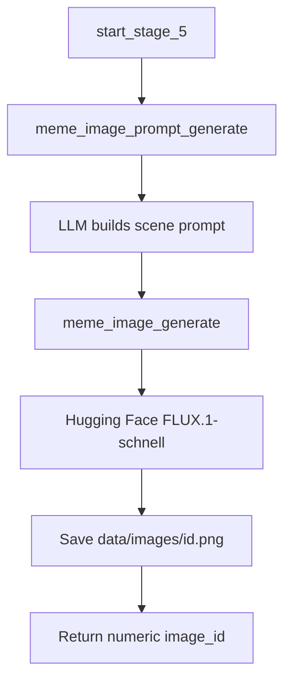

# Stage 5 — Image Generation

## Purpose

Stage 5 creates the visual asset for a post. It composes a text-to-image prompt grounded in the topic, caption, and research data, then renders a background image using Hugging Face inference. The output is a raw image file that Stage 6 composes with caption text.

---

## Position in the Pipeline

| Attribute | Value |
|-----------|-------|
| Stage number | 5 |
| Preceded by | Stage 4 — Caption Generation |
| Followed by | Stage 6 — Image Composition |
| Failure message | `"Failed to generate meme image"` |

---

## Module Structure

```
app/stage_5/
├── stage_5_man.py                                          # Stage orchestrator
├── make_prompt_for_image_for_meme/
│   └── meme_image_prompt.py                                # LLM image prompt builder
└── make_image_from_prompt/
    └── bg_image.py                                         # Hugging Face image renderer
```

| Module | Responsibility |
|--------|----------------|
| `stage_5_man.py` | Generates the prompt, then renders and saves the image. |
| `meme_image_prompt.py` | Builds a scene description from topic, caption, and research. |
| `bg_image.py` | Calls Hugging Face text-to-image API and writes a PNG to disk. |

---

## Workflow



### Step-by-step

1. **Prompt composition** — `meme_image_prompt_generate()` loads character profiles and instructs the LLM to describe a scene where the caption's character appears in a setting derived from the fact and research data.
2. **Grounding rules** — The prompt must follow the caption's character and action while using factual setting details from research when caption and fact diverge.
3. **Image rendering** — `meme_image_generate()` calls Hugging Face Inference API with model `black-forest-labs/FLUX.1-schnell`.
4. **File naming** — Images are saved as `data/images/{unix_timestamp}.png`.
5. **Return value** — The numeric timestamp ID (used as filename stem) is returned to the server.

---

## Inputs and Outputs

### Input

| Parameter | Type | Source |
|-----------|------|--------|
| `research_data` | `str` | Stage 3 summary |
| `meme_text` | `str` | Stage 4 caption |
| `chosen_topic` | `str` | Stage 2 topic text |

### Output

| Field | Type | Description |
|-------|------|-------------|
| Return value | `int` | Numeric image identifier (filename stem) |
| `data/images/{id}.png` | File | Generated background image |

### Error output

Returns `{"error": ...}` on LLM or Hugging Face failure.

---

## Environment Variables

| Variable | Required | Usage |
|----------|----------|-------|
| `BASE_URL` | Yes | LLM API base URL (prompt step) |
| `API_KEY` | Yes | LLM API key |
| `RESONNING_MODEL` | Yes | Model used for prompt generation |
| `HF_TOKEN` | Yes | Hugging Face access token for image inference |

Prompt generation uses temperature `0.8` for creative scene descriptions.

---

## Image Prompt Guidelines (LLM Instructions)

| Guideline | Detail |
|-----------|--------|
| Character | Must match the name in the Stage 4 caption |
| Setting | Derived from fact and research, not default show canon |
| Props | 2–3 key environmental elements from the fact |
| Output | Plain prompt text only — no markdown or conversational filler |

---

## External Dependencies

| Dependency | Usage |
|------------|-------|
| OpenAI-compatible LLM | Image prompt generation |
| `huggingface_hub.InferenceClient` | Text-to-image rendering |
| `black-forest-labs/FLUX.1-schnell` | Default diffusion model |

Network access and a valid Hugging Face token are required.

---

## Error Handling

| Condition | Behavior |
|-----------|----------|
| LLM prompt failure | Returns `{"error": ...}` |
| Invalid or missing `HF_TOKEN` | Returns `{"error": ...}` |
| Inference API timeout or quota error | Returns `{"error": ...}` |

---

## Integration

```python
# app/server.py
meme_image_id = start_stage_5(research_data, meme_text, chosen_topic_text)
```

The image ID is passed to Stage 6 for caption overlay and Stage 7 for post metadata (`poster` field).

Images are served at runtime via `GET /poster_images/<filename>`.

---

## Operational Notes

- Background images are stored separately from final composed posts (`data/results_images/`).
- Image generation cost and latency depend on Hugging Face model availability and account limits.
- Prompt quality directly affects visual relevance; weak Stage 3 research may produce generic scenes.

---

## Related Documentation

- [Stage 4 — Caption Generation](stage_4.md)
- [Stage 6 — Image Composition](stage_6.md)
- [Project README](../readme.md)
