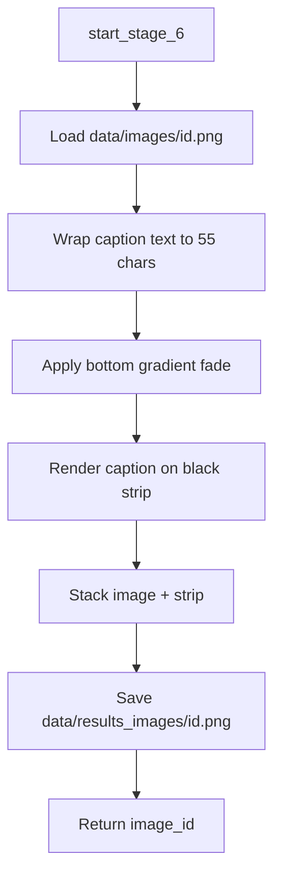

# Stage 6 — Image Composition

## Purpose

Stage 6 assembles the final post image. It takes the background generated in Stage 5 and renders the Stage 4 caption as wrapped, centered text on a dedicated strip below the image. The composed asset is what audiences see when the post is published to a content platform.

---

## Position in the Pipeline

| Attribute | Value |
|-----------|-------|
| Stage number | 6 |
| Preceded by | Stage 5 — Image Generation |
| Followed by | Stage 7 — Post Publishing |
| Failure message | `"Failed to edit meme image"` |

---

## Module Structure

```
app/stage_6/
├── stage_6_man.py                          # Stage orchestrator
└── edit_image/
    └── edit.py                             # Pillow-based image composition
```

| Module | Responsibility |
|--------|----------------|
| `stage_6_man.py` | Invokes image composition and returns the image identifier. |
| `edit.py` | Applies gradient fade, caption strip, and text rendering. |

---

## Workflow



### Step-by-step

1. **Source load** — Opens `data/images/{image_id}.png` from Stage 5.
2. **Text wrapping** — Caption is wrapped to 55 characters per line using `textwrap.wrap`.
3. **Typography** — DejaVu Sans Bold at 30pt is used when available; falls back to Pillow default font on error.
4. **Gradient fade** — A 100px bottom gradient (transparent to black) blends the image into the caption area.
5. **Caption strip** — A black strip sized to fit all lines is rendered with white centered text.
6. **Final composite** — Image and caption strip are stacked vertically and saved to `data/results_images/{image_id}.png`.
7. **Return value** — The same numeric `image_id` is returned (now referencing both source and result paths).

---

## Inputs and Outputs

### Input

| Parameter | Type | Source |
|-----------|------|--------|
| `image_id` | `int` or `str` | Stage 5 output |
| `text` | `str` | Stage 4 caption (server passes `chosen_topic_text`; caption overlay uses topic in current server wiring — see Integration) |

> **Note:** In `app/server.py`, Stage 6 is currently invoked as `start_stage_6(meme_image_id, chosen_topic_text)`. The `text` parameter receives the topic string at orchestration time. The caption from Stage 4 (`meme_text`) is available in the pipeline but not passed to Stage 6 in the current server implementation.

### Output

| Field | Type | Description |
|-------|------|-------------|
| Return value | `int` | Image identifier shared by source and result files |
| `data/results_images/{id}.png` | File | Final composed post image |

### Error output

Returns `{"error": ...}` when the source image is missing, font loading fails critically, or composition raises an exception.

---

## Visual Layout

| Element | Specification |
|---------|---------------|
| Caption font | DejaVu Sans Bold, 30pt |
| Line width | 55 characters |
| Padding | 20px |
| Line spacing | 10px |
| Bottom fade | 100px alpha gradient |
| Caption area | Black strip below image, white centered text |

---

## External Dependencies

| Dependency | Usage |
|------------|-------|
| `Pillow (PIL)` | Image loading, drawing, compositing |
| DejaVu Sans Bold (system font) | Primary caption typography |

---

## Error Handling

| Condition | Behavior |
|-----------|----------|
| Source PNG missing | Exception caught; returns `{"error": ...}` |
| Font file unavailable | Attempts default font; may return error if composition fails |
| Write failure on output path | Returns `{"error": ...}` |

---

## Integration

```python
# app/server.py
image_id = start_stage_6(meme_image_id, chosen_topic_text)
```

The returned ID is passed to Stage 7 as both `image_path` and referenced by the `poster` field.

Final images are served at runtime via `GET /results_images/<filename>`.

---

## Customization

Teams can adjust post layout by modifying constants in `edit.py`:

- `wrap(..., width=55)` — caption line length
- Font path and size
- `fade_height`, `padding`, `line_spacing`
- Caption strip background and text colors

---

## Related Documentation

- [Stage 5 — Image Generation](stage_5.md)
- [Stage 7 — Post Publishing](stage_7.md)
- [Project README](../readme.md)
