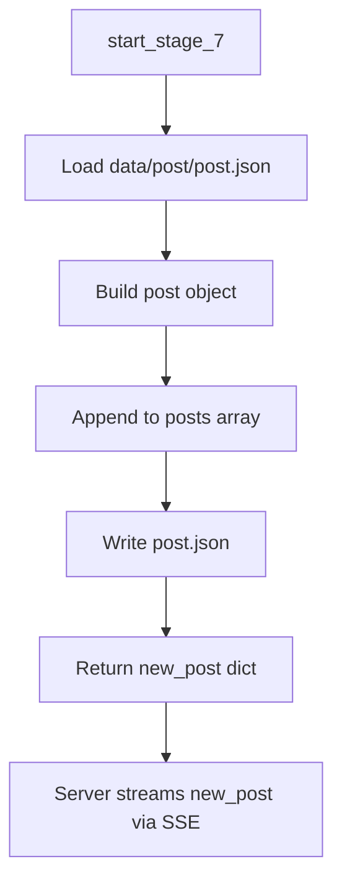

# Stage 7 — Post Publishing

## Purpose

Stage 7 is the final step of the post-generation pipeline. It assembles all prior stage outputs into a structured post record and persists it to the content library. Published posts are immediately available through the web UI and the `POST /get_all_posts` API.

This stage is the handoff point between automated generation and content distribution — the post object produced here is what creators and platforms consume.

---

## Position in the Pipeline

| Attribute | Value |
|-----------|-------|
| Stage number | 7 |
| Preceded by | Stage 6 — Image Composition |
| Followed by | None (terminal stage) |
| Failure message | `"Failed to create post"` |

---

## Module Structure

```
app/stage_7/
├── stage_7_man.py                          # Stage orchestrator
└── make_page/
    └── page.py                             # Post record assembly and persistence
```

| Module | Responsibility |
|--------|----------------|
| `stage_7_man.py` | Invokes post creation and returns the new post object. |
| `page.py` | Builds the post schema and appends it to `post.json`. |

---

## Workflow



### Step-by-step

1. **Library load** — `make_post_page()` reads the existing post array from `data/post/post.json`.
2. **Record assembly** — A new post object is constructed from pipeline outputs.
3. **Persistence** — The post is appended to the array and written back to disk.
4. **Return value** — The new post dict is returned to the server.
5. **Client delivery** — The server emits `{"new_post": {...}}` over the SSE stream and writes a human-readable summary to `r.md`.

---

## Inputs and Outputs

### Input

| Parameter | Type | Source |
|-----------|------|--------|
| `chosen_topic` | `str` | Stage 2 topic text |
| `research_data` | `str` | Stage 3 summary |
| `image_path` | `int` | Stage 6 image identifier |
| `poster` | `int` | Stage 5 background image identifier |

### Output

| Field | Type | Description |
|-------|------|-------------|
| Return value | `dict` | New post record (see schema below) |
| `data/post/post.json` | File | Updated content library |

### Post object schema

```json
{
  "topic": "string — headline / subject of the post",
  "description": "string — research summary or body copy",
  "image_path": "integer — ID of the composed final image",
  "poster": "integer — ID of the background image asset"
}
```

### Error output

Returns `{"error": ...}` when the post library cannot be read or written.

---

## Data Files

| Path | Format | Access |
|------|--------|--------|
| `data/post/post.json` | JSON array of post objects | Read/write by Stage 7; read by `GET /get_all_posts` |
| `data/results_images/{image_path}.png` | PNG | Final composed post image |
| `data/images/{poster}.png` | PNG | Background image asset |
| `r.md` | Markdown | Written by server after successful run (audit/review copy) |

---

## API and UI Integration

### Server SSE event

On success, the Flask server yields:

```json
{"new_post": {"topic": "...", "description": "...", "image_path": 123, "poster": 123}}
```

### Post library endpoint

```http
POST /get_all_posts
```

Returns the full contents of `data/post/post.json` as `application/json`.

### Image serving

| Route | Asset |
|-------|-------|
| `GET /results_images/<filename>` | Composed post image |
| `GET /poster_images/<filename>` | Background image |

The web UI loads posts from the library and displays images using these routes.

---

## Error Handling

| Condition | Behavior |
|-----------|----------|
| `post.json` missing or invalid | Returns `{"error": ...}` |
| Disk write failure | Returns `{"error": ...}` |
| Stage 7 failure | Server stops pipeline; no `new_post` event is emitted |

---

## Integration

```python
# app/server.py
new_post = start_stage_7(
    chosen_topic_text,
    research_data,
    image_id,
    meme_image_id,
)
```

After Stage 7 succeeds, the server also writes `r.md` with the topic, research, caption, and image reference for offline review.

---

## Content Platform Usage

Each published post record contains everything needed to render or syndicate content:

| Field | Platform use |
|-------|--------------|
| `topic` | Post title, headline, or social hook |
| `description` | Body copy, alt text context, or extended caption |
| `image_path` | Primary shareable image asset |
| `poster` | Thumbnail or alternate crop source |

Teams can map this schema directly to CMS fields, social schedulers, or custom frontends without re-running the pipeline.

---

## Operational Notes

- `post.json` grows append-only; archive or rotate the file for long-running deployments.
- Post IDs are Unix timestamps from Stage 5 image generation, not sequential integers.
- Resetting the library does not delete image files in `data/images/` or `data/results_images/`.

---

## Related Documentation

- [Stage 6 — Image Composition](stage_6.md)
- [Project README](../readme.md)
