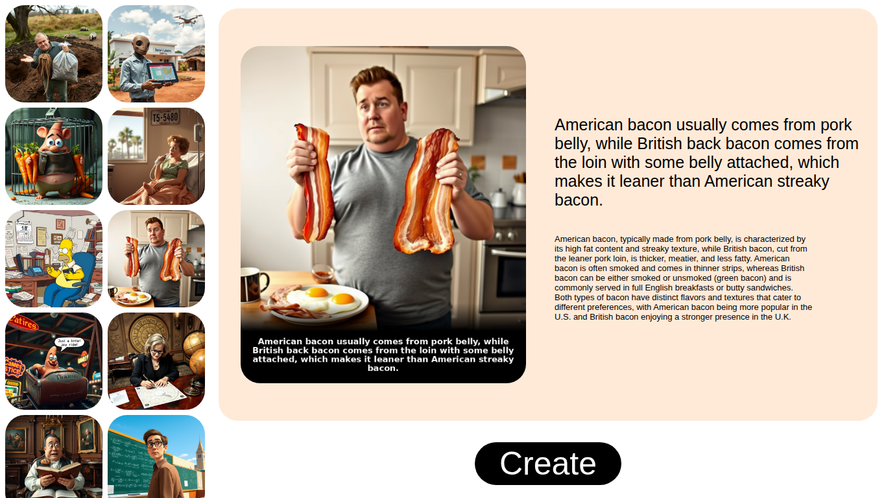
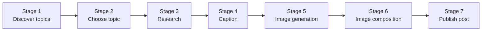
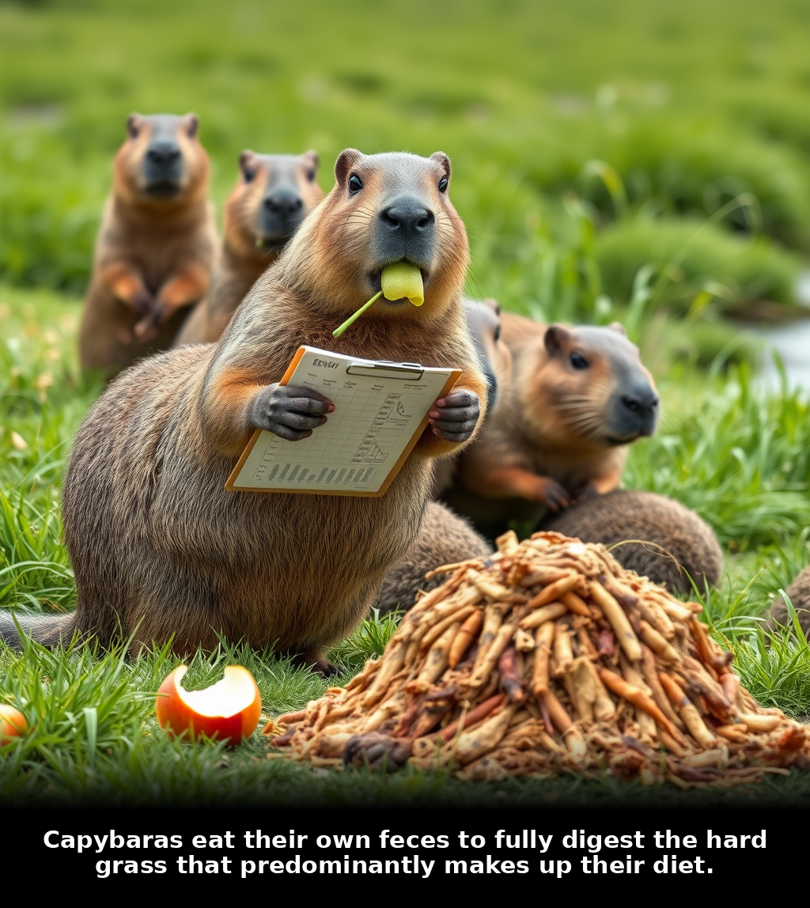
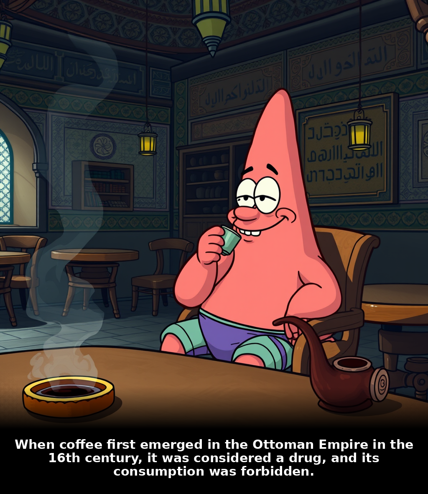
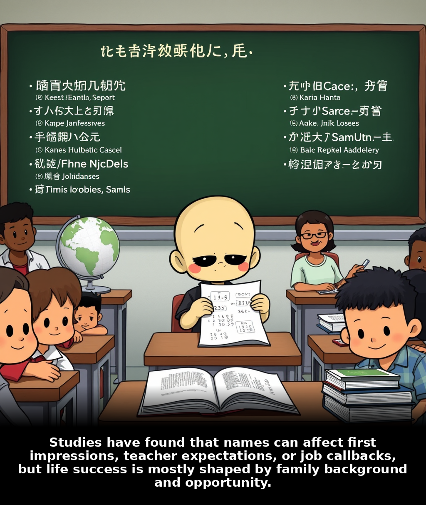
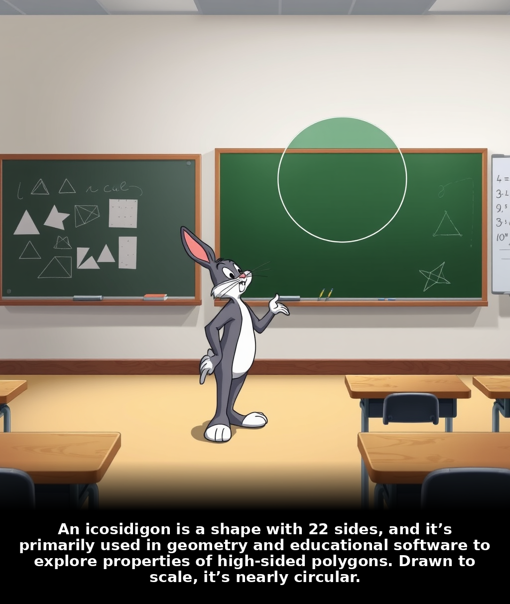

# RAGE
#### Research Automated Generation Engine

Automated post generator for content creation platforms. RAGE discovers topics, researches them, generates captions and imagery, and publishes finished posts ready for distribution through the web UI or API.

---

## Table of Contents

- [Overview](#overview)
- [Features](#features)
- [Architecture](#architecture)
- [Stage Documentation](#stage-documentation)
- [Prerequisites](#prerequisites)
- [Installation](#installation)
- [Configuration](#configuration)
- [Running the Application](#running-the-application)
- [API Reference](#api-reference)
- [Project Structure](#project-structure)
- [Testing](#testing)
- [Troubleshooting](#troubleshooting)

---

## Overview
<table>
  <tr>
    <td></td>
    <td></td>
    <td></td>
  </tr>
</table>


RAGE runs a seven-stage pipeline that turns live trending topics into publishable post assets — headline, body copy, and composed image. The Flask server orchestrates each stage sequentially and streams progress to the client via Server-Sent Events (SSE). When a run completes, the post is saved to the content library and written to `r.md` for review.

RAGE is designed for creators, publishers, and platform operators who need repeatable, automated post production without manual drafting at each step.

---

## Features

- **Topic discovery** — Finds current, post-worthy subjects from configured external sources.
- **Intelligent selection** — Validates, deduplicates, and selects the best topic using an LLM.
- **Automated research** — Gathers and summarizes source material for accurate post copy.
- **Caption generation** — Produces platform-ready headline text for the post image.
- **Visual asset creation** — Generates a background scene and composes the final image with caption overlay.
- **Post publishing** — Persists structured post records to a content library served by the web UI and API.
- **Real-time progress** — Streams stage-by-stage status updates to the browser.

---

## Architecture

The pipeline executes stages 1 through 7 in order. Any stage failure stops the run and returns an error event to the client.



| Stage | Module | Description |
|-------|--------|-------------|
| 1 | `stage_1` | Discover candidate topics and persist to `data/json/latest_topics.json`. |
| 2 | `stage_2` | Select one topic, exclude previously used entries, record the choice. |
| 3 | `stage_3` | Research the topic from web sources and produce a clean summary. |
| 4 | `stage_4` | Generate the post caption from the topic and research. |
| 5 | `stage_5` | Build an image prompt and generate the background via Hugging Face. |
| 6 | `stage_6` | Compose the final post image with caption overlay. |
| 7 | `stage_7` | Publish the post record to the content library. |

---

## Stage Documentation

Detailed documentation for each pipeline stage is available in the `documentations/` directory:

| Stage | Document | Summary |
|-------|----------|---------|
| 1 | [stage_1.md](documentations/stage_1.md) | Topic discovery and persistence |
| 2 | [stage_2.md](documentations/stage_2.md) | Topic validation, LLM selection, deduplication |
| 3 | [stage_3.md](documentations/stage_3.md) | Web search, scraping, research summarization |
| 4 | [stage_4.md](documentations/stage_4.md) | Caption generation |
| 5 | [stage_5.md](documentations/stage_5.md) | Image prompt and background generation |
| 6 | [stage_6.md](documentations/stage_6.md) | Final image composition |
| 7 | [stage_7.md](documentations/stage_7.md) | Post record publishing |

---

## Prerequisites

| Requirement | Version |
|-------------|---------|
| Python | 3.12+ |
| Git | Any recent version |
| LLM API | OpenAI-compatible endpoint (e.g. Ollama, OpenAI) |
| Hugging Face | Account with API token for image generation |

Network access is required at runtime for topic search, research scraping, LLM calls, and image generation.

---

## Installation

### 1. Clone the repository

```bash
git clone https://github.com/bravecoconut/rage.git
cd noname1
```

### 2. Create and activate a virtual environment

```bash
python3 -m venv .venv
source .venv/bin/activate
```

### 3. Install dependencies

```bash
pip install flask flask-cors openai huggingface_hub pillow beautifulsoup4 requests ddgs python-dotenv
```

---

## Configuration

Copy the example environment file and fill in your credentials:

```bash
cp .env.example .env
```

| Variable | Required | Description |
|----------|----------|-------------|
| `BASE_URL` | Yes | Base URL for the LLM API (e.g. `https://api.openai.com/v1` or a local Ollama endpoint). |
| `API_KEY` | Yes | API key for the LLM provider. |
| `RESONNING_MODEL` | Yes | Model name used for topic selection, research cleaning, and caption generation (e.g. `qwen3:8b`). |
| `HF_TOKEN` | Yes | Hugging Face access token for background image generation. |

See `.env.example` for placeholder values.

> **Security note:** Never commit `.env` or expose API tokens in version control.

---

## Running the Application

Start the server from the **project root** so relative data paths resolve correctly:

```bash
python3 app/server.py
```

The application starts on port **5000** by default.

| URL | Description |
|-----|-------------|
| `http://localhost:5000/` | Redirects to the main UI |
| `http://localhost:5000/noname` | Web interface — click **Create** to start a pipeline run |

Progress events are streamed to the browser in real time. On success, the finished post appears in the library panel.

---

## API Reference

### `POST /start`

Starts the full seven-stage pipeline. Returns an SSE stream (`text/event-stream`).

**Event types**

| Event payload | Meaning |
|---------------|---------|
| `{"starting_status": {"stage_N": true}}` | Stage *N* has started (N = 1–7). |
| `{"new_post": {...}}` | Pipeline completed successfully. |
| `{"error_status": "..."}` | A stage failed; the run has stopped. |

### `POST /get_all_posts`

Returns the full post library as JSON from `data/post/post.json`.

### `GET /results_images/<filename>`

Serves composed post images from `data/results_images/`.

### `GET /poster_images/<filename>`

Serves background images from `data/images/`.

---

## Project Structure

```
noname1/
├── app/
│   ├── server.py              # Flask application and pipeline orchestration
│   ├── templates/             # Web UI templates
│   ├── static/                # CSS and client-side JavaScript
│   ├── stage_1/ … stage_7/    # Pipeline stage modules
│   └── ...
├── data/
│   ├── json/                  # Topic tracking (latest, used, characters)
│   ├── post/                  # Published post library
│   ├── images/                # Generated background assets
│   └── results_images/        # Final composed post images
├── documentations/            # Per-stage technical documentation
├── tests/                     # Unit tests
├── .env.example               # Environment variable template
└── readme.md
```

---

## Testing

Run the test suite from the project root:

```bash
python3 -m unittest discover -s tests -v
```

Tests cover server error handling and SSE event parsing without invoking the full pipeline or external APIs.

---

## Troubleshooting

| Issue | Likely cause | Resolution |
|-------|--------------|------------|
| `Failed to fetch topics` | Network or search provider unavailable | Check internet connectivity and retry. |
| `Failed to choose topic` / research errors | Missing or invalid LLM credentials | Verify `BASE_URL`, `API_KEY`, and `RESONNING_MODEL` in `.env`. |
| `Failed to generate meme image` | Invalid Hugging Face token | Confirm `HF_TOKEN` is set and has the required permissions. |
| Data files not found | Server started outside project root | Always run `python3 app/server.py` from the `noname1/` directory. |
| Port already in use | Another process on port 5000 | Stop the conflicting process or change the port in `app/server.py`. |
---

## Generated Contents












